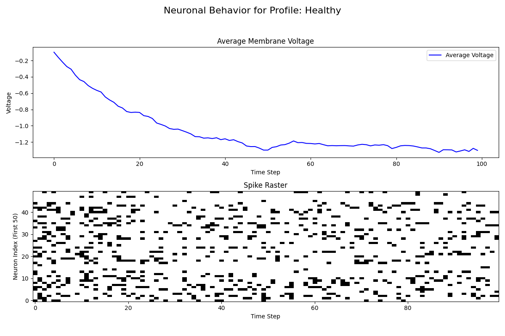
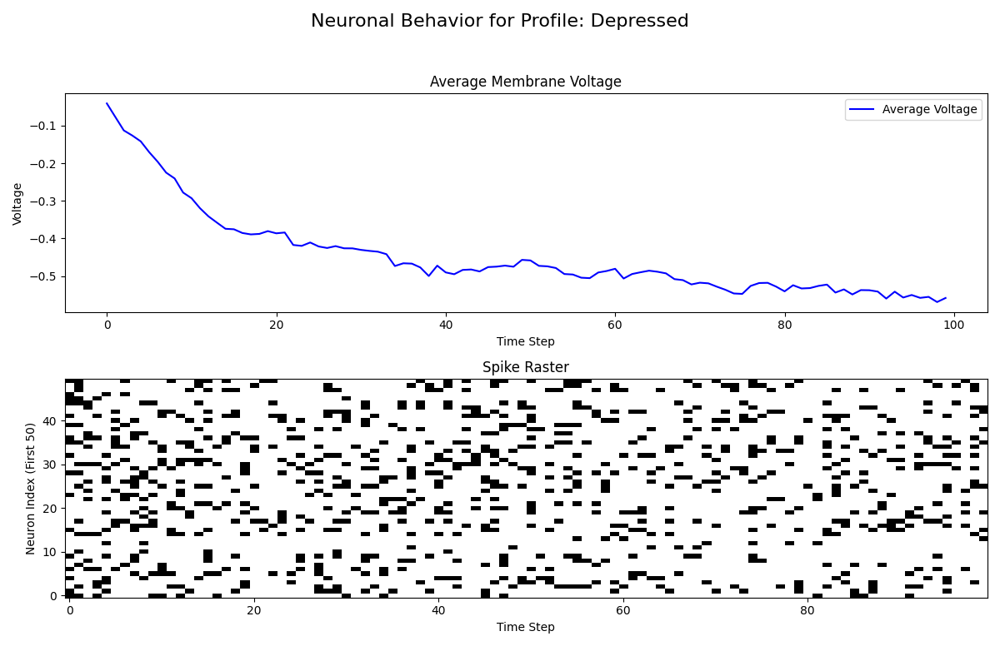
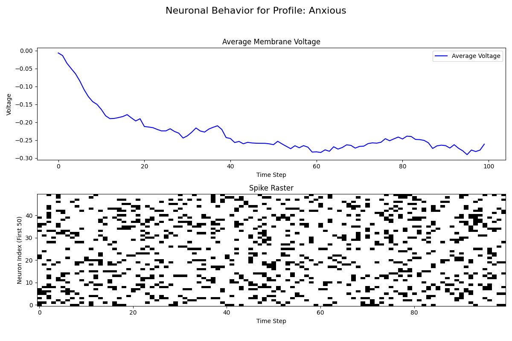
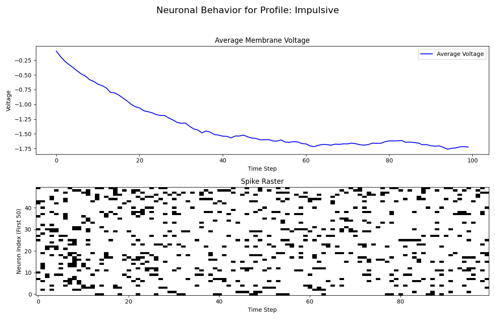
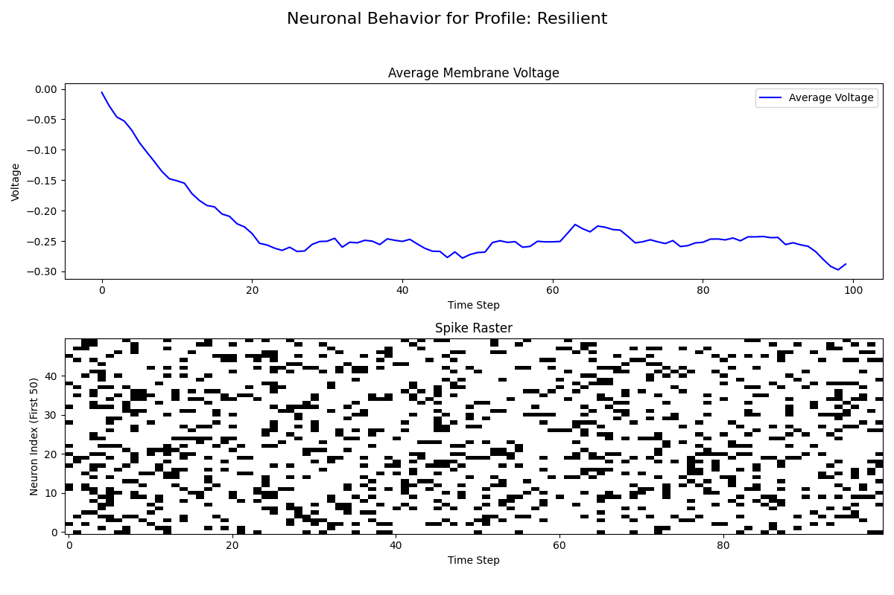

# Psychological Profiling with Extended LIF Neurons

> This project leverages the [Extended LIF Neurons](https://github.com/NullPointerExcy/Extended_LIF_Neurons) library to implement a psychological profiling system. The system maps psychological traits to neural parameters, demonstrating how neural models can be used to simulate complex psychological phenomena. By adjusting parameters like baseline noise, synaptic efficiency, membrane dynamics, and neuromodulatory signals, the network can mimic different psychological states.

> ⚠ Note: This is only an example analysis based on synthetic data and does not represent real neuroscience or psychology research.

## Conceptual Mapping: Psychological Traits ↔ Neural Parameters

| Psychological Profile Component | Neural Implementation via Extended LIF Neurons Model                                                                                                                                          |
| ------------------------------- | ----------------------------------------------------------------------------------------------------------------------------------------------------------------------------------------------- |
| **Healthy**                     | - **Balanced neural activity:** Moderate noise and stable synaptic dynamics <br/>- **Optimal connectivity:** Well-balanced excitatory/inhibitory interactions <br/>- **Robust neuromodulation:** Sigmoidal modulation for stability |
| **Anxiety**                     | - **High baseline noise:** e.g., `noise_std=0.3` <br/>- **Strong amygdalar connectivity:** Enhanced network weights <br/>- **Reduced inhibition:** Adjusted `neuromod_transform` to reduce inhibitory effects    |
| **Depression**                  | - **Reduced synaptic efficiency:** e.g., increased `depression_rate` <br/>- **Diminished dopaminergic modulation:** Weaker `neuromod_transform` on reward signals <br/>- **Adaptive threshold hysteresis:** e.g., `eta=0.2`  |
| **Impulsivity**                 | - **Faster membrane dynamics:** e.g., lower `tau` (around 10ms) <br/>- **High stochastic spiking:** e.g., `noise_std=0.4` <br/>- **Weaker prefrontal inhibition:** Asymmetric network connectivity                       |
| **Resilience**                  | - **Dynamic threshold adaptation:** e.g., higher `base_alpha=5.0` <br/>- **Robust synaptic recovery:** e.g., `recovery_rate=0.1` <br/>- **Balanced neuromodulation:** Using a sigmoidal `neuromod_transform`              |

## Synthetic Data Generation

To simulate different psychological profiles, the project includes a synthetic data generator. This tool creates sensory inputs and reward signals with statistical properties tailored to each profile. For example:
- **Healthy:** Balanced sensory variability with moderate reward signals.
- **Depressed:** Subdued sensory input and reward signals shifted toward negative values.
- **Anxious:** More erratic, bursty sensory inputs with volatile reward signals.
- **Impulsive:** Elevated sensory amplitudes to mimic rapid dynamics and bursty firing.
- **Resilient:** Stable sensory inputs with tightly regulated, balanced reward signals.

## Analysis of Results
### Membrane Potential Trends
- Anxious & Impulsive: Show a moderate decline in membrane potential, followed by fluctuations. This could indicate heightened but variable activity.
- Depressed: Displays a steady decline in membrane potential, with minimal fluctuations, possibly reflecting reduced excitability.
- Healthy: Exhibits a more stable pattern with an initial drop but a more balanced trend afterward.
- Resilient: Similar to the Healthy profile but with slight variations in membrane potential recovery.
### Neuronal Spike Activity
- Anxious & Impulsive: Show higher and more dispersed spike patterns, suggesting increased neuronal activity.
- Depressed: Displays reduced spike density, potentially corresponding to lower overall activity.
- Healthy & Resilient: Maintain more evenly distributed spike patterns, reflecting a stable neuronal state.

### Visualizations
Below are the simulated results for each profile:
<div align="center">
    
    
    
    
    
</div>

## Training and Evaluation
The project includes a training script that uses the synthetic data to adjust neural parameters so that the network's dynamics correspond to a target psychological profile. For example, the training objective might be to match a target "depression score" computed from the variance of the striatal voltage trace.

To train the model, run:
```bash
./src/models/psych_profile_network.py
```
Adjust the target profile and training parameters in the script as needed.

This script uses an Adam optimizer and monitors a loss defined as the squared difference between the current depression score and the target value. It also incorporates gradient clipping and uses surrogate gradients to allow training despite the non-differentiable spike function.

## Setup
- Install Extended LIF Neurons:
Either install locally in editable mode:

```bash
pip install -e /path/to/Extended_LIF_Neurons/src
```
Or directly from GitHub:

```bash
pip install git+https://github.com/NullPointerExcy/Extended_LIF_Neurons
```

## Future Work
- **Data Integration**:
Explore incorporating real-world data (e.g., EEG, fMRI) to further refine the psychological profiling.

- **Expanded Profiles**:
Add additional psychological states and refine the parameter mappings.

- **Advanced Dynamics**:
Investigate more complex neural dynamics and adaptive mechanisms for a more realistic simulation.

Feel free to experiment with the synthetic data parameters and network settings to better capture the nuances of different psychological states.

---