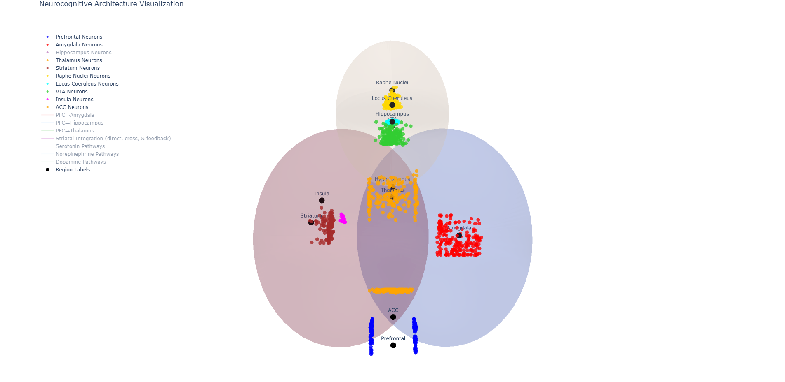

# NeuroEmoDynamics: A Neurocognitive Profiling Spiking Neural Network

> This project is a WIP and is created purely out of interest and curiosity (And I'm kinda of bored).

NeuroEmoDynamics is a biologically inspired spiking neural network (SNN) designed to simulate complex cognitive and
emotional states. The project uses by
own [Extended LIF Neurons](https://github.com/NullPointerExcy/Extended_LIF_Neurons), by using feedback and
cross-connections among key brain regions, including the prefrontal cortex, amygdala, hippocampus, thalamus, and
striatum, while integrating text-based emotion analysis.

## Features

### Biologically Inspired Architecture

- **Prefrontal Cortex (PFC):** Receives sensory inputs and modulates downstream regions.
- **Downstream Regions:**
    - Separate LIF layers for the amygdala, hippocampus, and thalamus.
    - Feedback mechanisms to regulate overall processing.
- **Cross-Connectivity:**
    - Integrates information across amygdala, hippocampus, and thalamus to simulate interdependent emotional and
      cognitive processes.
- **Striatum Integration:**
    - A final layer that aggregates signals for state estimation and emotional decision-making.

### Extended LIF Neuron Model

- Uses an enhanced Leaky Integrate-and-Fire (LIF) model with:
    - Neuromodulation mechanisms (serotonin, dopamine, norepinephrine) that regulate different regions.
    - Adaptive thresholds and noise integration.
    - Cross-neural interaction to simulate brain dynamics.

### Text-Based Emotion Analysis

- A separate **text-processing branch** using:
    - **Embedding layer** and **LSTM-based encoder**.
    - **Fusion mechanism** to integrate linguistic input with cognitive-emotional processing.
    - **Gating mechanisms** to allow text to override sensory/emotional biases (e.g., *"I feel happy even though I am
      depressed"*).

### Synthetic Data Generation

- Generates **synthetic sensory input and reward signals** based on different psychological profiles:
    - **Healthy**
    - **Depressed**
    - **Anxious**
    - **Impulsive**
    - **Resilient**

### Visualization Tools

- Run the `model_neuron_plot.py` script with a trained model, then open `interactive_viz.html` to visualize *(Limited to
  200 neurons per region for performance reasons.)*.

<div align="center">
    
</div

## Installation

```bash
# Clone the repository
git clone https://github.com/YourRepo/NeuroEmoDynamics.git
cd NeuroEmoDynamics

# Install dependencies
pip install -r requirements.txt
```

## How It Works

### 1. Profile-Based Neuromodulation

- Each psychological profile (depressed, anxious, etc.) is assigned a **neuromodulatory signature**.
- These modulate **serotonin, dopamine, and norepinephrine levels**, influencing:
    - Emotional response
    - Cognitive flexibility
    - Attention regulation

### 2. Text Processing & Emotional Override

- The text encoder extracts linguistic features.
- **Gating layers** determine if textual information can **override** the emotional profile.
- Example effects:
    - A **depressed** profile reading *"I feel strong"* may shift towards **joy**.
    - An **anxious** profile reading *"Everything is fine"* may reduce fear responses.

### 3. Spiking Network & Decision Making

- **PFC processes sensory input** and **modulates emotional states**.
- Feedback from the **amygdala, hippocampus, and thalamus** refines responses.
- **Striatum integrates all signals** to produce final outputs (emotion classification).

## Roadmap

- [ ] Improve text-based emotion influence.
- [ ] Optimize the LIF neuron feedback mechanisms.
- [ ] Extend visualization tools to include real-time simulation.
- [ ] Experiment with reinforcement learning for adaptive emotion modulation.

## References

This project uses the dataset **[emotion](https://huggingface.co/datasets/dair-ai/emotion)** from Hugging Face.

If you use this dataset, please cite:

```bibtex
@inproceedings{saravia-etal-2018-carer,
  title = "{CARER}: Contextualized Affect Representations for Emotion Recognition",
  author = "Saravia, Elvis  and
    Liu, Hsien-Chi Toby  and
    Huang, Yen-Hao  and
    Wu, Junlin  and
    Chen, Yi-Shin",
  booktitle = "Proceedings of the 2018 Conference on Empirical Methods in Natural Language Processing",
  month = oct # "-" # nov,
  year = "2018",
  address = "Brussels, Belgium",
  publisher = "Association for Computational Linguistics",
  url = "https://www.aclweb.org/anthology/D18-1404",
  doi = "10.18653/v1/D18-1404",
  pages = "3687--3697"
}
```

## License

[MIT License](LICENSE)

